# SQL summary

SQL is based on relational algebra. This uses set theory to describe relationships between data. Basic SQL queries use concepts like joins (reflecting unions and intersections from set theory.) The user can apply constraints and filters to the data in order to further limit the size of the resulting data set. SQL tables must have a predefined schema with each column having a fixed data type. This can be changed but the data in each column must match the current type.

# Links

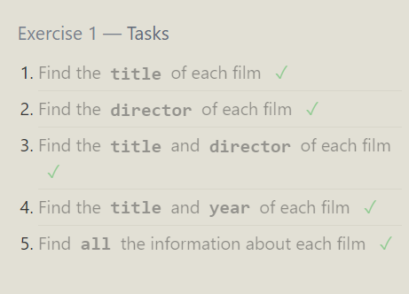
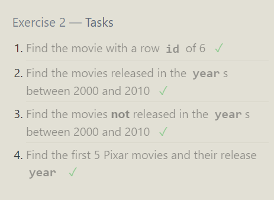
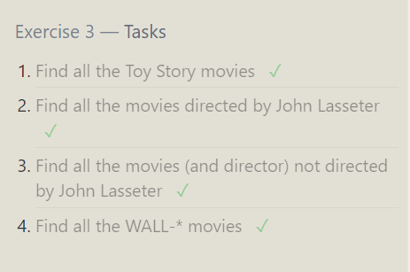
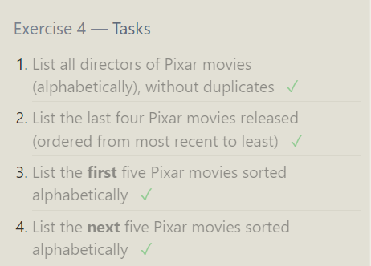
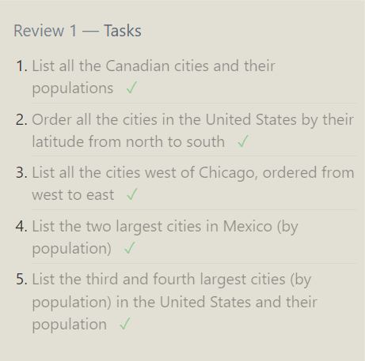
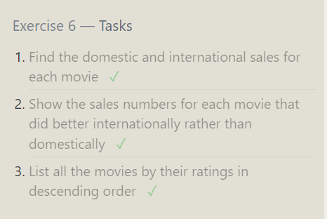
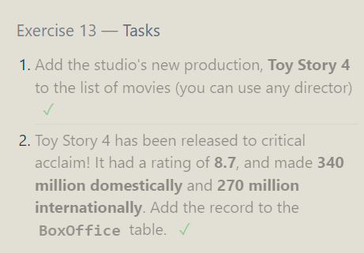
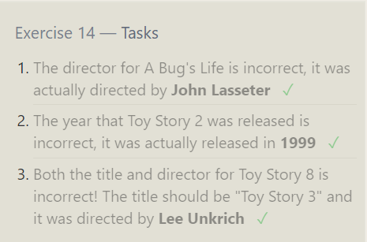
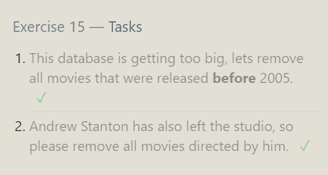
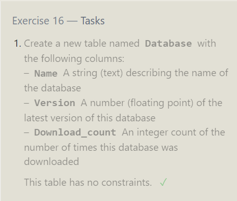
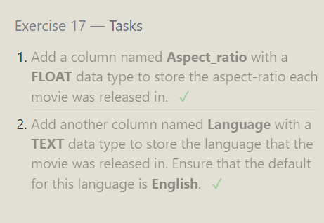
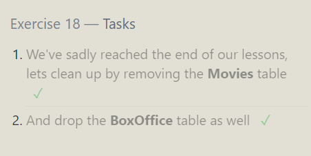